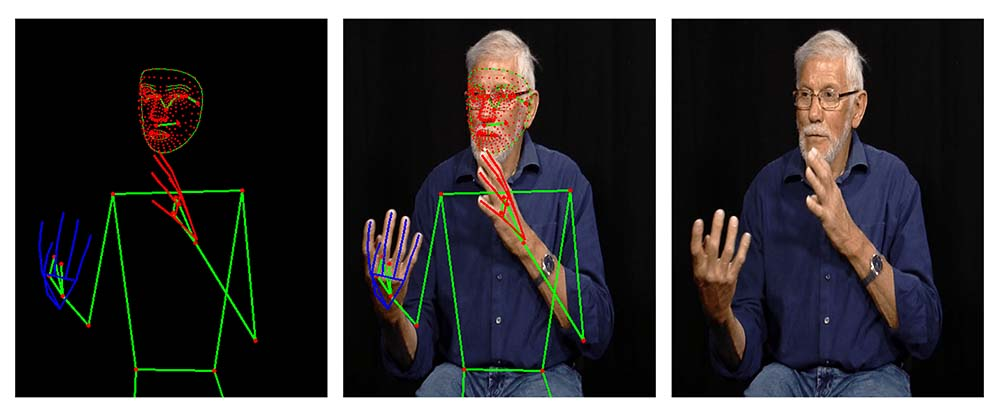
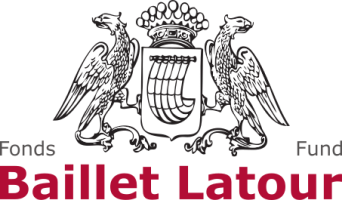

# LSFB Dataset Companion Library

LSFB Dataset is a companion library for the [French Belgian Sign Language (LSFB) dataset](https://lsfb.info.unamur.be/) released by the University of Namur. The library provides a set of tools helping to load the dataset in python data structures or to visualize the data. 

This library aims to reduce drastically the time you will spend on data loading and preprocessing allowing you to focus on your research.

## Datasets

Both datasets are based on the [LSFB Corpus](https://www.corpus-lsfb.be/). The corpus is the result of the tremendous work achieved by the members of the [LSFB labl](https://www.unamur.be/lettres/romanes/lsfb-lab) from the university of Namur.

The corpus data were sanatized in order to make them easier to use. Additional metadata were added to enhance the datasets. Two versions of the dataset are available:

- **[LSFB Isol](lsfb_isol.md)** : Suitable for the isolated sign language recognition task.
- **[LSFB Cont](lsfb_cont.md)** : Suitable for the continuous sign language recognition task.

Both datasets are based on the [LSFB Corpus](https://www.corpus-lsfb.be/) containing 40 hours of annotated and translated video. [Mediapipe](https://mediapipe.dev/) landmarks are also available for each datasets.

## Modules

The library offers you a set of module designed to help you to **download**, **visualize** and **load** the dataset in your machine learning pipeline. The available modules are : 

- **datasets** : contains pre-written [Pytorch](https://pytorch.org/) Dataset classes that can be used to load and feed directly the data into a Pytorch model.
- **[transforms](transforms.md)** : contains [transforms](https://pytorch.org/vision/stable/transforms.html) designed to apply various pre-processing to the videos.
- **visualisation** : contains helper function enabling you to visualise the data.
- **utils**: contains function helping to load the various csv and video into dataframes

## Sponsors

Without our sponsors, this library would not be possible.

